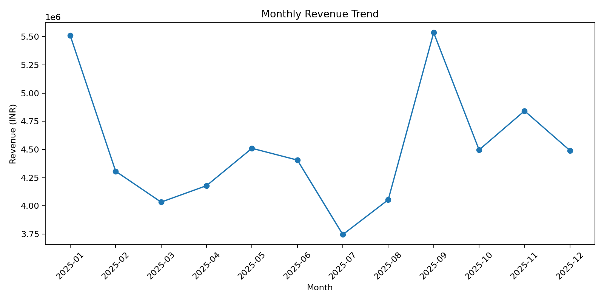
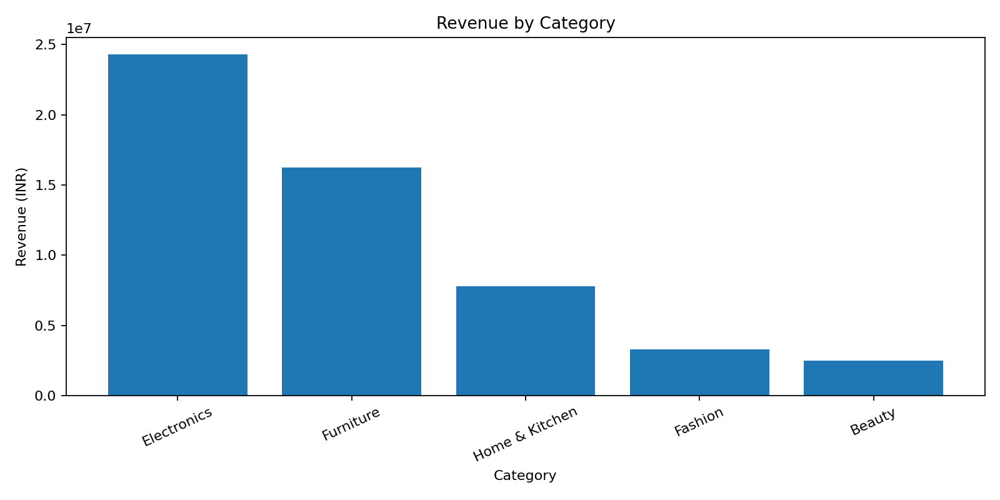

# 🛒 E-commerce Sales Analysis — Python

An end-to-end **Data Analyst portfolio project** using Python to clean, analyze and visualize e-commerce transaction data and convert it into business insights.

## 🎯 Business Problem

An e-commerce business wants to understand:

- How revenue changes over time
- Which categories and products drive revenue
- Which regions and sales channels perform best
- How order cancellations and returns affect operations
- Which KPIs management should monitor

## 🧰 Tools

**Python | Pandas | NumPy | Matplotlib | Seaborn | Jupyter Notebook**

## 🔄 End-to-End Workflow

**Raw Data → Data Quality Check → Cleaning → KPI Analysis → EDA → Trend Analysis → Segmentation → Business Insights**

## 📂 Repository Structure

```text
Ecommerce-Sales-Analysis/
├── ecommerce_sales.csv
├── cleaned_sales.csv
├── ecommerce_sales_analysis.ipynb
├── data_analysis.py
├── README.md
├── requirements.txt
├── .gitignore
└── output charts (.png / analysis tables)
```

> The repository currently keeps the files in the root for simplicity. The project can later be reorganized into `data/`, `notebooks/`, `src/` and `outputs/` folders.

## 🧹 Data Cleaning

The project handles:

- Duplicate records
- Missing regions
- Missing payment methods
- Missing discount values
- Date conversion
- Numeric type conversion
- Monthly feature creation
- Completed-order filtering for revenue KPIs

## 📊 Key KPIs

| KPI | Result |
|---|---:|
| Total Revenue | ₹54,111,495.64 |
| Completed Orders | 4,405 |
| Unique Customers | 894 |
| Units Sold | 8,376 |
| Average Order Value | ₹12,284.11 |
| Cancellation Rate | 6.80% |
| Return Rate | 5.10% |

## 🔎 Key Insights

1. **September 2025 generated the highest monthly revenue**, at approximately **₹5,535,347**.
2. **Electronics** was the highest-revenue category and contributed approximately **44.9%** of completed-order revenue.
3. **South** generated the highest revenue among regions.
4. **Website** was the highest-revenue sales channel.
5. **Headphones** was the top revenue-generating product.
6. The highest month-over-month revenue growth occurred in **2025-09**, at approximately **36.5%**.

## 📈 Visualizations

### Monthly Revenue


### Revenue by Category


### Revenue by Sales Channel


### Top 10 Products


### Order Status


## 💡 Business Recommendations

- Monitor the highest-performing categories and products for inventory planning.
- Compare sales channels using revenue and AOV rather than order volume alone.
- Investigate cancellation and return patterns by category, region and channel.
- Track monthly revenue growth to identify periods requiring additional marketing or operational attention.
- Use customer-level revenue and order frequency for future RFM segmentation.

## ▶️ How to Run

### Install dependencies

```bash
pip install -r requirements.txt
```

### Run the Python script

```bash
python data_analysis.py
```

### Open the notebook

Open:

```text
ecommerce_sales_analysis.ipynb
```

and run the cells sequentially.

## 🧠 Interview Discussion

This project can be explained using the following structure:

**1. Business Problem**  
Understand revenue, product, regional and channel performance.

**2. Data Preparation**  
Validated data quality, handled missing values and duplicates, converted data types and created analytical fields.

**3. Analysis**  
Used Pandas groupby, aggregation, time-series analysis and segmentation.

**4. KPIs**  
Calculated revenue, orders, AOV, customers, units, cancellation rate and return rate.

**5. Insights**  
Identified revenue trends, top categories, products, regions and channels.

**6. Business Impact**  
Provided recommendations around inventory, channel performance, customer analysis and operational monitoring.

## 🚀 Future Enhancements

- Add SQL analysis
- Build a Power BI dashboard
- Add RFM customer segmentation
- Add cohort analysis
- Add customer lifetime value
- Automate monthly reporting

---

**Author:** Swatantra Pratap Singh  
**Target Role:** Data Analyst / Senior Data Analyst
